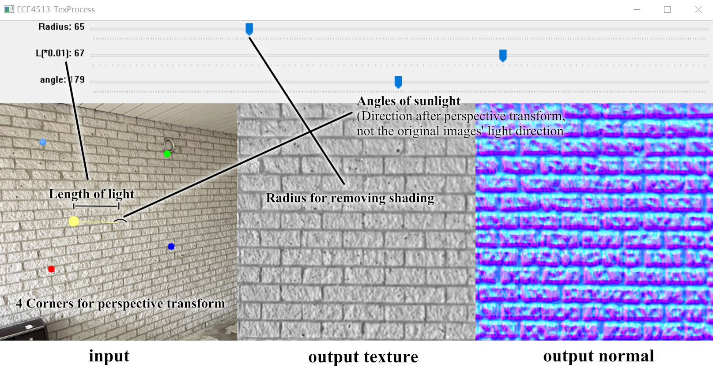

# **ECE4513-Group-Project-13**

## Run
- Run the ```main.py```
- The input image is *img.png*, the output is *output_tex.png* and *output_nm.png*, default size 512x512
## Control
1. Click on the screen to select 4 points from the input image for perspective transform
2. Drag the track bar to adjust parameters:
    - **Radius**: the radius of gaussian blur in removing shading. *(Recommended value: 20-60)*
    - **L**: the strength and slope of the sunlight from 0.00-1.00, determines the strength of partial normal in the light direction
    - **angle**: the direction of sunlight from 0-355, it is the direction after the perspective transform
3. Press the **Space** bar and the program will start

4. Press **Esc** to quit

